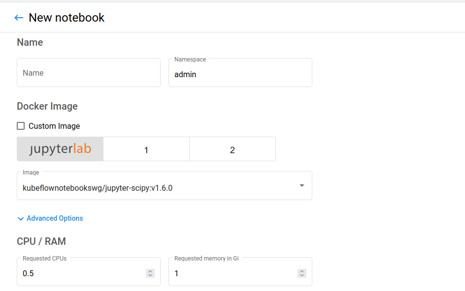
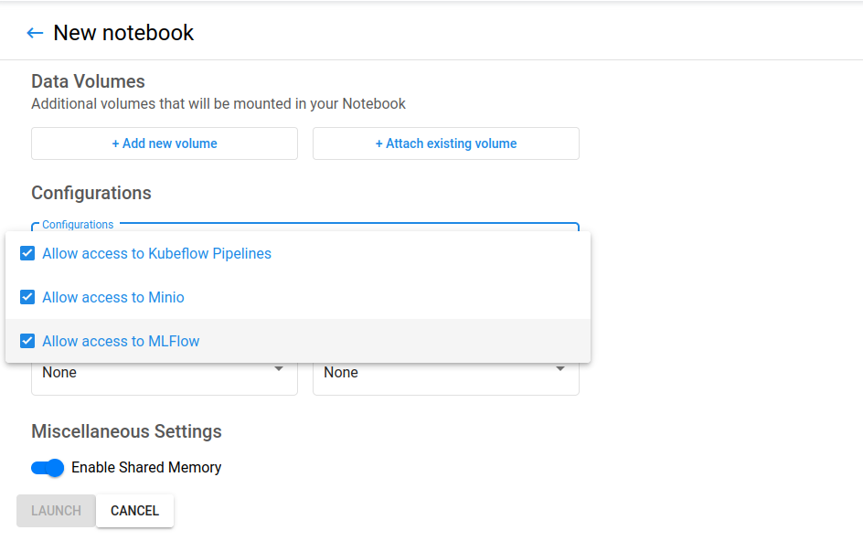

# E2E pipeline

> This example is based on [canonical/kubeflow-example/e2e-wine-kfp-mlflow](https://github.com/canonical/kubeflow-examples/tree/main/e2e-wine-kfp-mlflow)
> with some modifications to simplify the codebase. This example is explained
> in more details in this [blog post](https://ubuntu.com/blog/mlops-pipeline-with-mlflow-seldon-core-and-kubeflow-pipelines).

## Deploy

[deploy.md](./deploy.md)


## Running the demo

You should first navigate to the kubeflow dashboard at `$IPADDR.nip.io` and
create a jupyter notebook server under the "Notebook" tab in the sidebar. Then,
you can choose an appropriate cpus and memory for your server; the
default value is good enough for this demo. Also, check

- `Allow access to Minio`
- `Allow access to MLFlow`

so that the necessary environment variables will be imported to the notebook
server.




You can either choose to run the demo with the python script by first installing
the required package `pip install -r requirement.txt`, and then run `python3
pipeline.py` to build, train, and deploy the model. Or you can follow the
notebook `e2e-kfp-mlflow-seldon-pipeline.ipynb` that basically do the same thing
as the python script.

After running the script or notebook, you can view the result in the "Runs" tab
and view the model in mlflow dashboard. For more information about demo, you can
visit the [blog
post](https://ubuntu.com/blog/mlops-pipeline-with-mlflow-seldon-core-and-kubeflow-pipelines).

Lastly, you can try to make inference of new data using the script `sample-prediction.sh`.

```sh
microk8s kubectl get all -n admin
microk8s kubectl get sdep -n admin
```


### Reference

* [GitHub - canonical/bundle-kubeflow: Charmed Kubeflow](https://github.com/canonical/bundle-kubeflow)
* [Kubeflow + MLflow on Juju with Microk8s](https://github.com/canonical/mlflow-operator)
* [GitHub - canonical/bundle-kubeflow: Charmed Kubeflow](https://github.com/canonical/bundle-kubeflow)
* [Quick start guide to Kubeflow | Documentation | Charmed Kubeflow](https://charmed-kubeflow.io/docs/quickstart)

